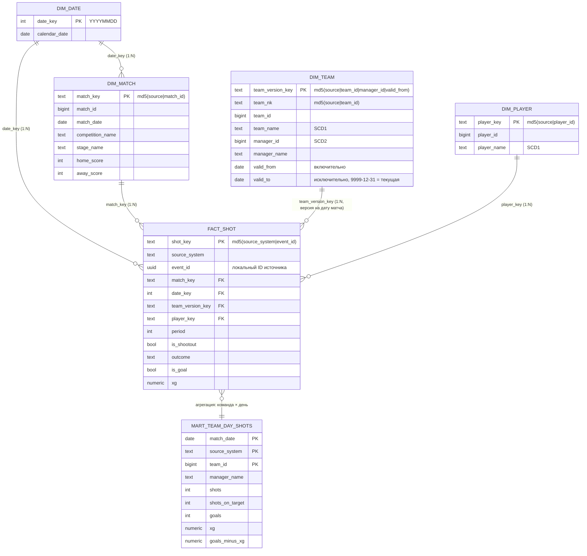

# Удары в плей-офф ЧМ-2022 и Евро-2024: небольшое хранилище на PostgreSQL, dbt и Airflow

Домашнее задание 2 по курсу «Современные технологии хранения данных».

Идея проекта: взять открытые данные о футбольных матчах, загрузить их в PostgreSQL в исходном виде,
с помощью dbt собрать из них «звезду» и небольшую витрину, проверить результат тестами и только
после этого показать его потребителю. Запуском всей цепочки управляет Airflow.

Здесь описано, как устроен проект и как его запустить. Результаты запусков, проверки и найденные
по ходу проблемы собраны в [REPORT.md](REPORT.md).

---

## 1. Данные

### Почему футбол

Мне нужны были данные с датами и понятными категориями, которые к тому же легко проверить.
Футбол подходит хорошо: у каждого матча есть официальный счёт, и число голов в моих таблицах
обязано с ним сойтись. Это готовый независимый контроль, ничего специально придумывать не нужно.

### Источник

[StatsBomb Open Data](https://github.com/statsbomb/open-data) — открытый набор событий футбольных
матчей (передачи, удары, отборы и т. д.). Разрешено бесплатное некоммерческое использование со ссылкой на источник.

Беру только матчи плей-офф двух турниров:

- чемпионат мира 2022 (`competition_id=43`, `season_id=106`), 16 матчей;
- чемпионат Европы 2024 (`competition_id=55`, `season_id=282`), 15 матчей.

Из всех событий оставляю только удары (`type = Shot`). Получается 31 матч и 866 ударов,
из них 65 — удары в сериях пенальти. Такой объём ещё можно просмотреть глазами. Два турнира нужны
для того, чтобы у части команд успели смениться тренеры: без этого не с чем было бы работать в
истории атрибутов (подробнее в разделе 3).

### Как зафиксирован срез

Репозиторий StatsBomb иногда обновляется, поэтому файлы скачиваются не с ветки `master`, а по
конкретному коммиту `4b73468fc5b0f1950f9f66fada70ad3a4f9327cb`. Так повторное скачивание всегда даёт
одни и те же байты. Этим занимается скрипт `scripts/fetch_source.py`. Он также сохраняет
`SOURCE_MANIFEST.json` с sha256 каждого исходного файла.

Готовый срез уже лежит в `data/input/baseline/` (около 2,7 МБ), так что для запуска интернет не нужен.
Формат — JSON Lines: в каждой строке исходная запись без изменений (`record`) и немного служебной
информации о том, откуда она взята (`_source`).

### Какие поля используются

- **Матч:** `match_id`, `match_date`, турнир и сезон, стадия (`competition_stage`), команды хозяев и гостей
  с тренерами (`managers[]`), счёт `home_score`/`away_score`, стадион, судья, `last_updated`
  (время последнего обновления записи в источнике — его я использую как номер версии).
  Счёт включает дополнительное время, но не включает серию пенальти.
- **Удар:** `id` (UUID события), `period` (1–2 — основное время, 3–4 — дополнительное, 5 — серия пенальти),
  минута и секунда, команда, игрок, исход (`shot.outcome`), тип удара, часть тела, координаты и
  `shot.statsbomb_xg`. xG (expected goals) — это оценка вероятности того, что удар станет голом,
  число от 0 до 1 без единиц измерения.

### Время

Датой события считаю `match_date`, то есть календарную дату матча. Поле `kick_off` (время начала)
пришлось не использовать: временная зона у него не указана и к тому же не выдерживается.
Например, финал ЧМ-2022 начался в 18:00 по Катару (15:00 UTC), а в источнике записано `17:00`.
Матч Нидерланды — Аргентина начался в 22:00 по Катару (19:00 UTC), а записано `19:00`.
Все матчи среза начинались вечером, между 18:00 и 22:00 по местному времени (UTC+2 и UTC+3),
поэтому местная дата везде совпадает с датой по UTC. Служебные отметки времени в хранилище
(`loaded_at`, `published_at`) хранятся с часовым поясом (`timestamptz`).

## 2. Для кого и что считаем

**Потребитель** — аналитик футбольной команды или журналист, который готовит разбор плей-офф.

**Вопросы к данным:**

1. Сколько ударов, ударов в створ и голов было у каждой команды в каждый игровой день и сколько
   ожидаемых голов (xG) она при этом создала? Кто забивал больше, чем «положено» по xG?
2. Как менялась результативность команды при разных главных тренерах?

**Что именно считается:**

- *удар* — событие `Shot` в игровое время. Удары серии пенальти хранятся, но в витрину не попадают:
  на счёт матча они не влияют;
- *удар в створ* — исход `Goal`, `Saved` или `Saved to Post`;
- *гол из удара* — исход `Goal`. Автоголы в StatsBomb ударами не считаются, поэтому счёт матча иногда
  больше, чем число голов из ударов;
- *xG команды* — сумма `statsbomb_xg` по её ударам.

**MVP** — витрина «команда × день матча» с числом ударов, ударов в створ, голов, голов с пенальти,
суммой xG, разницей «голы − xG» и тренером на дату матча. Рядом видна дата последнего успешного обновления.
Дальше можно было бы добавить xG по игрокам, динамику по минутам и связь ударов с предшествующими передачами.

## 3. Модель

**Одна строка факта** `dds.fact_shot` — это один удар в его последней версии. Ключ — `(source_system, event_id)`.

**Одна строка витрины** — команда в конкретный день матча. Команда не играет два матча в один день,
поэтому это то же самое, что «команда в матче». Ключ — `(source_system, team_id, match_date)`.



**Связи.** Каждый удар относится ровно к одному матчу, одной дате, одному игроку и одной версии
команды: все связи факта с измерениями — «многие к одному». У матча две команды (хозяева и гости),
у команды может быть несколько версий (по одной на каждого тренера). Отдельный тест следит за тем,
чтобы на дату матча каждому удару соответствовала **ровно одна** версия команды.

**Ключи.** Суррогатные ключи — это `md5` от натурального ключа, причём в натуральный ключ всегда
входит `source_system`. Номера матчей, команд, игроков и событий уникальны только внутри своего
источника. Если бы данные пришли от второго поставщика, одинаковые номера не должны склеивать разные
сущности (это проверено в случае 4 отчёта).

### Почему «звезда»

Все вопросы потребителя — это суммы и количества в разрезе дня, команды, тренера, турнира и стадии.
«Звезда» здесь естественна: один факт, у него простые связи «многие к одному», поэтому JOIN не
размножает строки, а удары, голы и xG можно спокойно складывать на любом уровне. Средние (например,
xG за матч) считаю как сумму, делённую на количество, а не как среднее средних. Измерения короткие,
выносить справочники в «снежинку» смысла нет.

Другой подход понадобился бы, если бы:

- источников было много и они менялись — тогда удобнее интеграционный слой в стиле Data Vault
  (или hNhM, как в Яндекс Go), а «звезду» строить поверх него;
- нужно было анализировать последовательности событий (какие передачи привели к удару) — для этого
  агрегатный факт не годится, нужна событийная модель;
- появились связи «многие ко многим» (например, удар и все игроки в кадре freeze-frame) — тогда нужна таблица-мост.

### История атрибутов: нужна ли она

Для второго вопроса нужна. Тренер — это атрибут команды, и между турнирами он меняется: у Испании
Луис Энрике сменился на де ла Фуэнте, у Португалии Сантуш — на Мартинеса, у Нидерландов ван Гал — на Кумана.
Если просто перезаписывать тренера (SCD1), все прошлые удары окажутся «при новом тренере», и сравнение
потеряет смысл. Поэтому `dim_team` ведётся как SCD2 по тренеру, а удар связывается с той версией
команды, которая действовала **на дату матча**. Название команды и имя игрока ведутся как SCD1:
исправление опечатки не должно порождать новую версию.

**Как получаются периоды.** Даты назначения тренера в данных нет, поэтому начало версии (`valid_from`) —
это первый матч, где этот тренер указан. Версия заканчивается (`valid_to`), когда после последнего
матча этого тренера впервые появляется другой тренер. Если другого тренера нет, версия открыта
(`9999-12-31`). Интервал полуоткрытый: `[valid_from, valid_to)`. Если источник вдруг укажет двух
тренеров на одну дату, периоды пересекутся. Такую ситуацию я специально не пытаюсь разрешить
автоматически: её ловят тесты, и результат не публикуется.

**Что нашлось в настоящих данных.** В источнике есть свои странности. У Марокко один и тот же тренер
записан под двумя разными ID: `Hoalid Regragui` до 14.12.2022 и `Walid Regragui` 17.12.2022.
У Бразилии в четвертьфинале 09.12.2022 тренером указан Теле Сантана, который тренировал сборную в
1980-х, хотя в 1/8 финала был Тите. Источник я не правлю: эти случаи описаны в ограничениях в отчёте.

## 4. Слои хранилища

Всё хранится в одной базе `dwh`, слои разнесены по схемам.

| Слой | Таблицы | Что там лежит |
|---|---|---|
| **Raw** | `raw.batches`, `raw.matches`, `raw.shots` | строки входных файлов без изменений (`jsonb`) и сведения о загрузке: какой файл, его sha256, порядок |
| staging | `stg.stg_matches`, `stg.stg_shots` (view) | те же записи с нормальными типами (`bigint`, `date`, `uuid`, `interval`, `numeric`) и понятными именами колонок. Повторы пока не убраны |
| **ODS** | `ods.ods_matches`, `ods.ods_shots`, `ods.ods_team_manager_obs` | по одной актуальной записи на каждый матч и удар: побеждает запись с более поздней версией, при равенстве — из более поздней загрузки |
| **DDS** | `dds.dim_date`, `dds.dim_team`, `dds.dim_player`, `dds.dim_match`, `dds.fact_shot` | «звезда» с суррогатными ключами. Тренер выбирается на дату матча |
| **Витрина (кандидат)** | `mart.mart_team_day_shots` | агрегат «команда × день» за выбранный период |
| **Опубликованная витрина** | `publish.team_day_shots`, `publish.publication_log`, view `publish.v_team_day_shots` | то, что видит потребитель. Меняется только после успешных тестов |
| служебное | `audit.*`, `ops.pipeline_lock`, `evidence.*` | строки, на которых упали тесты; замок от параллельных запусков; снимки для сравнения запусков |

В dbt модели ссылаются друг на друга через `ref()`, а на raw-таблицы — через `source()`.

## 5. Кто что делает и почему это ELT

- **PostgreSQL** хранит все слои и выполняет весь SQL.
- **dbt** описывает, какие таблицы из каких строятся и какими тестами проверяются. Сам dbt данные
  не обрабатывает: он собирает SQL и отправляет его в базу.
- **Airflow** решает, когда и в каком порядке всё запускать, какой период обрабатывать, и не даёт
  опубликовать результат, если проверки не прошли.

Это ELT, потому что данные сначала загружаются в хранилище как есть (Extract + Load), а преобразуются
уже внутри него, средствами SQL (Transform). Исходные записи остаются в raw, поэтому при изменении
правил можно всё пересчитать без повторной выгрузки.

## 6. DAG `football_shots_elt`

```
resolve_slice → acquire_pipeline_lock → ingest_raw → dbt_run_candidate → dbt_test_candidate → publish → report_publication
                                                                            └→ diagnose_quality_failure (только если тесты упали)
                                                     в конце всегда → release_pipeline_lock
```

| Задача | Что делает | Что искать в логе |
|---|---|---|
| `resolve_slice` | определяет, за какой период обрабатывать матчи | итоговый период и откуда он взят (из параметров или из расписания) |
| `acquire_pipeline_lock` | занимает хранилище на время запуска | «DWH занят запуском …», если приходится ждать |
| `ingest_raw` | загружает входные файлы в raw | `[load]`, `[skip]`, `[drop]` по каждому файлу и итоговое число строк |
| `dbt_run_candidate` | строит все слои и кандидат витрины (11 моделей) | стандартный вывод dbt run |
| `dbt_test_candidate` | прогоняет 62 теста | PASS/FAIL по каждому тесту |
| `publish` | публикует кандидат. Выполняется только после успешных тестов | `replaced N -> M rows, checksum=…` |
| `report_publication` | печатает журнал публикаций и свежие строки витрины | — |
| `diagnose_quality_failure` | запускается только при падении тестов | какие тесты упали, строки-нарушители и последняя успешная публикация |
| `release_pipeline_lock` | освобождает хранилище. Выполняется всегда и не влияет на итоговый статус | — |

**Какой период обрабатывается.** У запуска три параметра: `scenario` (какой набор входных файлов брать),
`slice_start` и `slice_end`. Период — это **даты матчей**, а не даты запуска: левая граница включается,
правая нет. Если параметры не заданы, период берётся из расписания Airflow (`data_interval`). Если и
его нет (например, ручной запуск без параметров), задача падает с понятной ошибкой: подставлять
«сегодня» вместо даты события было бы неправильно.

**Ежедневный режим.** Он включается переменной `FOOTBALL_DAG_SCHEDULE=daily`. Запуск в 00:00 UTC
19.12.2022 обработает матчи 18 декабря (финал ЧМ). Это проверено backfill-запуском
(`evidence/logs/daily_backfill_2022-12-19.log`). Одна тонкость Airflow 3: обычный `"@daily"` там даёт
интервал нулевой длины (начало и конец совпадают), поэтому длина интервала в сутки задана явно через
`CronTriggerTimetable(..., interval=timedelta(days=1))`.

**Кандидат отдельно, публикация отдельно.** Если тест падает, dbt не откатывает уже построенные
таблицы, и в `mart` остаётся ошибочный кандидат. Поэтому потребитель читает не `mart`, а `publish`.
Эту схему меняет только задача `publish`, и только после успешных тестов. Перед публикацией
она проверяет, что кандидат построен этим же запуском и за тот же период, а затем заменяет строки
периода целиком в одной транзакции.

**Параллельные запуски.** Запуски выполняются строго по одному: `max_active_runs=1` в DAG плюс
замок `ops.pipeline_lock` в базе на всё время запуска. Замок пришлось добавить после того, как
обнаружилось, что backfill-запуски `max_active_runs` не ограничивает (история описана в отчёте, §7).

## 7. Версии

| Что | Версия |
|---|---|
| PostgreSQL | 16.13 |
| Python | 3.11 |
| Apache Airflow | 3.1.8 (с constraints-3.1.8 для Python 3.11), apache-airflow-providers-standard 1.12.0, psycopg2-binary 2.9.11 |
| dbt | dbt-core 1.10.13, dbt-postgres 1.10.0 (в отдельном виртуальном окружении) |
| Docker-образы | `postgres:16`, `apache/airflow:3.1.8-python3.11` |

dbt и Airflow стоят в разных виртуальных окружениях, потому что у них конфликтуют зависимости.

## 8. Как запустить с нуля

### Вариант A: Docker Compose

```bash
docker compose up -d --build     # PostgreSQL + Airflow (standalone); первый старт занимает несколько минут
```

Дальше открыть http://localhost:8080 (в учебном режиме вход без пароля), найти DAG `football_shots_elt`,
нажать Trigger и указать `scenario=baseline`, `slice_start=2022-12-03`, `slice_end=2024-07-15`.
То же самое можно сделать из консоли:

```bash
docker compose exec airflow airflow dags unpause football_shots_elt
docker compose exec airflow bash /opt/project/scripts/trigger_and_wait.sh 01_baseline_first baseline 2022-12-03 2024-07-15
docker compose exec airflow psql -f /opt/project/sql/queries.sql              # запросы к витрине
docker compose exec airflow python /opt/project/scripts/independent_check.py   # независимая сверка
docker compose exec airflow bash /opt/project/scripts/run_all_evidence.sh      # все опыты из отчёта
```

Подключиться к базе из DataGrip или psql: `localhost:5433`, база `dwh`, пользователь и пароль `dwh`.
На Linux стоит указать `AIRFLOW_UID=$(id -u)` в `.env`, иначе контейнер не сможет писать в `dbt/target`.

### Вариант B: без Docker (Ubuntu или WSL2)

Нужны PostgreSQL 16 на `localhost:5432` и Python 3.11.

```bash
bash scripts/setup_local.sh      # роли и базы, окружения для Airflow и dbt, airflow db migrate
source scripts/local_env.sh
airflow standalone &             # UI на http://localhost:8080
airflow dags unpause football_shots_elt
scripts/trigger_and_wait.sh 01_baseline_first baseline 2022-12-03 2024-07-15
psql -f sql/queries.sql
python scripts/independent_check.py
scripts/run_all_evidence.sh      # полный набор опытов, около 8 минут
```

dbt можно запустить и без Airflow:
`cd dbt && dbt build --profiles-dir . --vars '{slice_start: "2022-12-03", slice_end: "2024-07-15", run_id: manual}'`.

> Логи и скриншоты в `evidence/` получены на варианте B. `docker-compose.yml` собран на тех же
> версиях и проходит `docker compose config`, но целиком в Docker стенд не поднимался, поэтому
> при первом запуске через Docker стоит внимательно посмотреть на вывод.

## 9. Входные данные и тестовые изменения

- `data/input/baseline/` — настоящий срез StatsBomb (`matches.jsonl`, `shots.jsonl`, `SOURCE_MANIFEST.json`).
- `data/input/manifests/*.json` — наборы входных файлов для каждого сценария: базовый срез плюс файл с изменением.
- `data/input/scenarios/` — сами изменения, по одной-две строки:
  - `duplicate/` — повторно переданная настоящая запись удара, без изменений;
  - `history_overlap/` — **синтетическая** версия финала, где у Аргентины два тренера;
  - `late_correction/` — **синтетическая** новая версия удара с исправленным xG (0.30340916 → 0.45);
  - `second_source/` — **синтетический** «партнёрский» источник с теми же номерами матча, команд, игрока и события;
  - `corrupted/` — **синтетическая** испорченная запись: xG 7.835 вместо 0.7835 (потерянная запятая).

Истории изменений и второго источника в открытом наборе нет, поэтому для этих случаев тестовые
записи сделаны вручную (так разрешает задание). Все они помечены `"synthetic": true` и словом
`SYNTHETIC` в названиях и используются только в своих сценариях. В базовом срезе их нет.

## 10. Что где лежит

```
airflow/dags/football_shots_elt.py   DAG
loader/load_raw.py                   загрузка файлов в raw
loader/publish.py                    публикация проверенной витрины
dbt/                                 модели (staging, ods, dds, marts), тесты, макросы
sql/queries.sql                      запросы к витрине
scripts/                             скачивание среза, запуск DAG, снимки и сравнение запусков, независимая сверка, установка
docker-compose.yml, docker/          стенд в Docker
evidence/                            логи, результаты запросов, сравнения, скриншоты
REPORT.md                            отчёт
```
